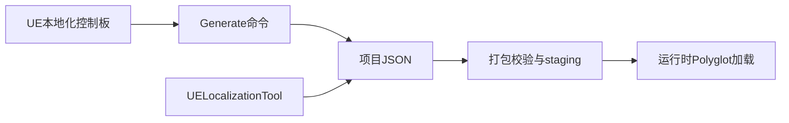

<div align="center">

# LocalizationOverrides

**UE5 运行时 FText 本地化覆盖方案**

打包后可编辑 JSON · 无需重 Cook 主包 · 配套桌面翻译工具

<br>

[](LocalizationOverrides/LocalizationOverrides.uplugin)
[](LocalizationOverrides/LocalizationOverrides.uplugin)
[](LocalizationOverrides/LocalizationOverrides.uplugin)
[](Tools/LocalizationOverrideEditor/)

<br>

[快速开始](#-快速开始) ·
[安装](#-安装与启用) ·
[JSON 规范](#-json-规范) ·
[插件 API](#-localizationoverrides-插件) ·
[桌面工具](#-uelocalizationtool-桌面工具) ·
[FAQ](#-常见问题)

</div>

---

## 简介

将 Unreal Engine 本地化数据导出为项目根目录下可编辑的 **JSON**，打包后以 **Non-UFS** 文件放在游戏 EXE 旁，运行时注册为 **Polyglot Text Data**——在不重新 Cook 主包的情况下，修改已发布游戏的 `FText` 翻译。

<table>
<tr>
<td width="50%" valign="top">

**本仓库包含**

| 组件 | 路径 |
|------|------|
| UE 插件 | [`LocalizationOverrides/`](LocalizationOverrides/) |
| 桌面工具 | [`UELocalizationTool.exe`](Tools/LocalizationOverrideEditor/publish/UELocalizationTool.exe) |

</td>
<td width="50%" valign="top">

**典型场景**

- 发版后 hotfix 文本翻译
- 翻译人员无需打开 UE 编辑器
- 运行时切换游戏语言
- JSON 与 `.pak` 分离，便于 diff 与版本管理

</td>
</tr>
</table>

> **能力边界**
>
> | | |
> | :--- | :--- |
> | **支持** | 打包后修改 `FText` · 运行时切换 culture · JSON staging 到 EXE 旁 |
> | **不支持** | 打包后替换模型/贴图/音频 · `FString` 自动本地化 · 打包时自动生成 JSON |

---

## 目录

- [快速开始](#-快速开始)
- [适用环境](#-适用环境)
- [仓库结构](#-仓库结构)
- [核心概念](#-核心概念)
- [目录结构（目标项目）](#-目录结构目标项目)
- [安装与启用](#-安装与启用)
- [首次配置工作流](#-首次配置工作流)
- [JSON 规范](#-json-规范)
- [LocalizationOverrides 插件](#-localizationoverrides-插件)
- [UELocalizationTool 桌面工具](#-uelocalizationtool-桌面工具)
- [UE 原生资产本地化](#-ue-原生资产本地化)
- [常见问题](#-常见问题)
- [日志与调试](#-日志与调试)
- [版本升级](#-版本升级)
- [功能边界速查](#-功能边界速查)
- [附录](#-附录)

---

## 快速开始

```text
① 复制插件 → ② UE 收集文本 → ③ Generate → ④ 工具编辑 → ⑤ 打包
```

| # | 操作 |
|:-:|------|
| 1 | 将 [`LocalizationOverrides/`](LocalizationOverrides/) 复制到 `<Project>/Plugins/LocalizationOverrides` 并启用 |
| 2 | 在 UE 本地化控制板配置目标（如 `Game`）并完成文本收集 |
| 3 | 控制台执行 `LocalizationOverrides.Generate`，生成 `<Project>/LocalizationOverrides/*.json` |
| 4 | 运行 **UELocalizationTool** 编辑翻译并保存 |
| 5 | Build 并打包（Build 自动校验 JSON 并 staging 到 EXE 旁） |

---

## 适用环境

| 项目 | 要求 |
|------|------|
| Unreal Engine | 5.x（当前验证 [**5.7.0**](LocalizationOverrides/LocalizationOverrides.uplugin)） |
| 平台 | **Win64** |
| 文本类型 | `FText` / 可本地化 UMG |
| 前置 | 已配置 UE Localization Dashboard |

> 插件二进制须与目标 UE 版本匹配；跨版本复用旧 DLL 可能导致加载失败。

---

## 仓库结构

```text
UElocalizationextension/
├── LocalizationOverrides/              # UE 插件 → 安装到目标项目 Plugins/
│   ├── LocalizationOverrides.uplugin
│   └── Source/
│       ├── LocalizationOverrides/      # Runtime
│       └── LocalizationOverridesEditor/
├── Tools/
│   └── LocalizationOverrideEditor/     # C# WinForms 源码
│       └── publish/
│           └── UELocalizationTool.exe  # 预编译工具 (~108 MB)
└── README.md
```

这是**插件分发仓库**，不含 `.uproject`。JSON 数据属于目标项目，不在本仓库内。

---

## 核心概念

| 概念 | 说明 |
|------|------|
| **项目 JSON** | 位于 `<Project>/LocalizationOverrides/`，非插件 Content |
| **Non-UFS staging** | 打包时 JSON 复制到 EXE 旁，不进 `.pak` / IoStore |
| **Polyglot Text Data** | 运行时向 `FTextLocalizationManager` 注册覆盖 |
| **`nativeCulture`** | `Game.json` 源文本所属 culture |
| **`defaultCulture`** | `languages.json` 启动默认 culture（可被 CLI 覆盖） |



---

## 目录结构（目标项目）

<details>
<summary><b>开发阶段</b></summary>

```text
<Project>/
├── LocalizationOverrides/
│   ├── languages.json
│   └── Game.json
├── Plugins/
│   └── LocalizationOverrides/
└── <ProjectName>.uproject
```

</details>

<details>
<summary><b>打包后（Shipping）</b></summary>

```text
<PackagedGame>/
└── <ProjectName>/
   └── Binaries/
      └── Win64/
         ├── <ProjectName>-Win64-Shipping.exe
         └── LocalizationOverrides/
            ├── languages.json
            └── Game.json
```

</details>

> Shipping 包**优先**读取 EXE 旁 JSON。勿在包体其他位置手工放置第二份，以免编辑错误副本。

---

## 安装与启用

**1. 复制插件**

```text
<Project>/Plugins/LocalizationOverrides
```

**2. 启用插件** — 编辑 `.uproject` 或在 UE「编辑 → 插件」中启用：

```json
{
  "Name": "LocalizationOverrides",
  "Enabled": true
}
```

**3. 编译** — 若二进制与 UE 版本不匹配，关闭编辑器后重新编译插件或项目。

---

## 首次配置工作流

| 步骤 | 操作 | 建议角色 |
|:----:|------|:--------:|
| 1 | UE 本地化控制板创建目标，设置 Native Culture，添加 culture | 程序 / 策划 |
| 2 | 文本收集、翻译，确保 manifest / archive 存在 | 策划 / 翻译 |
| 3 | 执行 `LocalizationOverrides.Generate` 或 Commandlet | 程序 |
| 4 | 确认生成 `languages.json` 与 `Game.json` | 程序 |
| 5 | UELocalizationTool 编辑翻译 | 翻译 |
| 6 | Build 并打包 | 程序 |

> **注意**：打开编辑器或打包时**不会**自动生成 JSON，须显式执行 Generate。

---

## JSON 规范

### 通用要求

| 规则 | 值 |
|------|-----|
| Schema | `version: 1` |
| 编码 | **UTF-16 LE + BOM** |
| 空翻译 | 可省略键；运行时回退到源文本或 UE 已有结果 |

### `languages.json`

| 字段 | 类型 | 说明 |
|------|------|------|
| `version` | number | 固定 `1` |
| `defaultCulture` | string | 启动 culture（无 CLI 时） |
| `cultures` | string[] | 允许的 culture 列表 |

```json
{
  "version": 1,
  "defaultCulture": "zh-Hans",
  "cultures": ["zh-Hans", "en", "de"]
}
```

### `Game.json`

| 字段 | 类型 | 说明 |
|------|------|------|
| `version` | number | 固定 `1` |
| `target` | string | 固定 `"Game"` |
| `nativeCulture` | string | 须在 `languages.json.cultures` 中 |
| `entries` | array | 文本条目 |

**每条 entry：**

| 字段 | 类型 | 说明 |
|------|------|------|
| `namespace` | string | UE 命名空间 |
| `key` | string | UE 键 |
| `source` | string | 源文本 |
| `translations` | object | culture → 翻译 |

> 唯一身份 = **`namespace` + `key`**，不可重复。

```json
{
  "version": 1,
  "target": "Game",
  "nativeCulture": "zh-Hans",
  "entries": [
    {
      "namespace": "UI.MainMenu",
      "key": "StartGame",
      "source": "开始游戏",
      "translations": {
        "zh-Hans": "开始游戏",
        "en": "Start Game",
        "de": "Spiel starten"
      }
    }
  ]
}
```

---

## LocalizationOverrides 插件

### 模块

| 模块 | 加载阶段 | 职责 |
|------|:--------:|------|
| `LocalizationOverrides` | PreDefault | culture · JSON 加载 · Polyglot · 蓝图 API |
| `LocalizationOverridesEditor` | Default | 控制台 · Commandlet · 生成 |

### 生成 JSON

<table>
<tr><th>方式</th><th>命令</th></tr>
<tr>
<td>编辑器控制台</td>
<td>

```text
LocalizationOverrides.Generate
```

</td>
</tr>
<tr>
<td>Commandlet</td>
<td>

```bat
UnrealEditor-Cmd.exe "<Project>.uproject" -run=LocalizationOverridesGenerate -unattended -nop4 -utf8output
```

</td>
</tr>
<tr>
<td>蓝图（仅编辑器）</td>
<td><code>Generate Localization Override Files</code></td>
</tr>
</table>

生成器读取 `Config/Localization/*_Export.ini`，合并已有 JSON（保留无 archive 的手工 culture），原子写入。

> Generate 会从 UE archive 同步。建议 Generate 前备份，并约定「UE 同步」与「工具编辑」顺序。

### 运行时

**JSON 查找：**

| 环境 | 优先路径 |
|------|----------|
| 编辑器 / Standalone | `<Project>/LocalizationOverrides/` |
| Shipping 包 | EXE 旁 `LocalizationOverrides/` |

**启动 culture 优先级：**

```text
CLI (-culture / -language / -locale)  →  languages.json.defaultCulture  →  系统语言
```

**热重载：** 运行中修改 JSON 需**重启游戏**；插件检测 MD5 变更并警告。

### 蓝图 API

源码：[`LocalizationOverridesBlueprintLibrary.h`](LocalizationOverrides/Source/LocalizationOverrides/Public/LocalizationOverridesBlueprintLibrary.h)

| 蓝图节点 | 说明 |
|----------|------|
| `Reload Localization Overrides` | 重新加载 JSON |
| `Set Game Culture` | 切换 culture；可选持久化到 `languages.json` |
| `Get Available Cultures` | 可用 culture 列表 |
| `Get Current Game Culture` | 当前 culture |
| `Get Localization Overrides Directory` | JSON 目录路径 |
| `Generate Localization Override Files` | 编辑器内生成 |

<details>
<summary><b>Set Game Culture 用法示例</b></summary>

| Culture | Save as Default | 效果 |
|---------|:---------------:|------|
| `en` | `false` | 仅当前进程切换 |
| `en` | `true` | 切换并写入 `defaultCulture`，下次启动生效 |

返回 `false` 时查 Output Log：culture 未声明 · JSON 无效 · 目录只读 · 非 Game Thread。

</details>

### 打包与 Build

[`LocalizationOverrides.Build.cs`](LocalizationOverrides/Source/LocalizationOverrides/LocalizationOverrides.Build.cs) 在 Game/Client/Server Build 时：

- 校验 `LocalizationOverrides/` 存在且 JSON 合法（UTF-16 BOM）
- 必须含 `languages.json` + 至少一个目标 JSON
- 以 **Non-UFS** staging 到 `$(TargetOutputDir)/LocalizationOverrides/`
- `.bak` / `.tmp` 不发布
- 缺失或损坏 → **Build 失败**

---

## UELocalizationTool 桌面工具

### 获取

| 方式 | 说明 |
|------|------|
| **预编译** | [`publish/UELocalizationTool.exe`](Tools/LocalizationOverrideEditor/publish/UELocalizationTool.exe) |
| **体积** | ~108 MB（.NET 9 自包含，无需安装运行时） |
| **源码编译** | 见下方命令 |

```powershell
dotnet publish Tools\LocalizationOverrideEditor\LocalizationOverrideEditor.csproj `
  -c Release -r win-x64 --self-contained true `
  -p:PublishSingleFile=true `
  -o Tools\LocalizationOverrideEditor\publish
```

<details>
<summary><b>小体积发布（可选）</b></summary>

使用 `--self-contained false` 可将 exe 降至约 1–3 MB，但目标机须安装 [.NET 9 Desktop Runtime](https://dotnet.microsoft.com/download)。

</details>

### 发版目录

```text
<GameRoot>/
├── <Game>.exe
├── UELocalizationTool.exe          # 可选
└── LocalizationOverrides/
   ├── languages.json
   └── Game.json
```

### 功能一览

| 功能 | 说明 |
|------|------|
| 多语系编辑 | `Game.json` 表格编辑 |
| Culture 管理 | 添加 / 删除语系 |
| 启动语言 | 设置 `defaultCulture` |
| 搜索筛选 | 文本搜索 · 空翻译 / 已翻译 |
| 批量操作 | 撤销 · Excel 式粘贴 |
| 安全保存 | UTF-16 BOM 原子写入 · 3 组 `.bak` · 失败回滚 |
| 目录探测 | 项目根 · 打包目录 · 祖先 BFS |

### 使用

1. 启动 `UELocalizationTool.exe`
2. 选择项目根或打包目录
3. 编辑翻译 → **保存**
4. 若后续执行 UE Generate，确认合并结果

**界面：** 中/英切换 · 亮/暗主题 · 偏好存 `ui-settings.json`

> 错误对话框仍为中文；仅界面 chrome 与状态栏双语。

---

## UE 原生资产本地化

```text
Content/Mesh/SM_UI.uasset          ← 默认
Content/L10N/en/Mesh/SM_UI.uasset  ← 英语变体
```

| | 文本 (JSON) | 资产 (L10N) |
|---|:---:|:---:|
| 打包后修改 | 支持 | 不支持 |
| 切换 culture | 即时（Polyglot） | 需重载 / 重启 |
| 修改方式 | 编辑 EXE 旁 JSON | 改 UE 项目并重 Cook |

---

## 常见问题

<details>
<summary><b>Generate 提示找不到 .manifest</b></summary>

先在 UE 本地化控制板执行文本收集，确保 `Config/Localization/` 存在 manifest / archive。

</details>

<details>
<summary><b>新增 culture 后翻译不显示</b></summary>

1. `languages.json.cultures` 已包含该 culture
2. `Game.json.translations` 有非空值
3. 修改的是当前环境实际读取的 JSON
4. 编码为 UTF-16 LE BOM
5. Output Log 无 schema 错误

</details>

<details>
<summary><b>文本变了，模型/贴图没变</b></summary>

文本由本插件覆盖；资产由 `Content/L10N/<culture>/` 加载。切换 culture 后重启或重载关卡。

</details>

<details>
<summary><b>打包后出现两个 LocalizationOverrides</b></summary>

正确位置仅 EXE 旁一份。清理旧输出目录与 AutomationTool 缓存后重新 Build。

</details>

<details>
<summary><b>Generate 会覆盖人工翻译吗？</b></summary>

会从 UE archive 同步，尽量保留无 archive 的手工 culture。建议 Generate 前备份。

</details>

<details>
<summary><b>工具保存失败</b></summary>

常见原因：文件被占用 · 编码错误 · schema 失败 · 目录只读。见 `UELocalizationTool-startup-error.log`。

</details>

---

## 日志与调试

| 来源 | 关键词 / 文件 |
|------|---------------|
| UE Output Log | `LocalizationOverrides` · `LocalizationOverridesGenerator` |
| 工具启动失败 | `UELocalizationTool-startup-error.log` |

---

## 版本升级

- 不同 UE 小版本须重新编译插件 DLL
- 升级后清理插件 `Binaries` / `Intermediate` 再完整编译
- 勿删除项目 `Content` / `Config` / `LocalizationOverrides`
- 确认包体仅 EXE 旁一份 JSON

---

## 功能边界速查

| 功能 | 支持 |
|------|:----:|
| 打包后修改 `FText` 翻译 | ✅ |
| 运行时切换文本 culture | ✅ |
| 保存 JSON 默认启动语言 | ✅ |
| 打包时 staging JSON 到 EXE 旁 | ✅ |
| UE 原生资产本地化回退 | ✅ |
| 打包前/打包时自动生成 JSON | ❌ |
| 普通 `FString` 自动本地化 | ❌ |
| 打包后注入/替换 FBX、PNG、WAV | ❌ |

---

## 附录

### RunUAT 打包

```powershell
RunUAT.bat BuildCookRun -project="<Project>.uproject" -platform=Win64 -clientconfig=Shipping -build -cook -stage -pak -iostore
```

### 源码索引

| 文件 | 职责 |
|------|------|
| [`LocalizationOverridesSubsystem.cpp`](LocalizationOverrides/Source/LocalizationOverrides/Private/LocalizationOverridesSubsystem.cpp) | 运行时加载 · Polyglot |
| [`LocalizationOverridesGenerator.cpp`](LocalizationOverrides/Source/LocalizationOverrides/Private/LocalizationOverridesGenerator.cpp) | JSON 生成 |
| [`LocalizationOverrides.Build.cs`](LocalizationOverrides/Source/LocalizationOverrides/LocalizationOverrides.Build.cs) | Build 校验 · staging |
| [`Program.cs`](Tools/LocalizationOverrideEditor/Program.cs) | 桌面工具 |

---

<div align="center">

**LocalizationOverrides** · UE5 Runtime Text Localization Override

</div>
